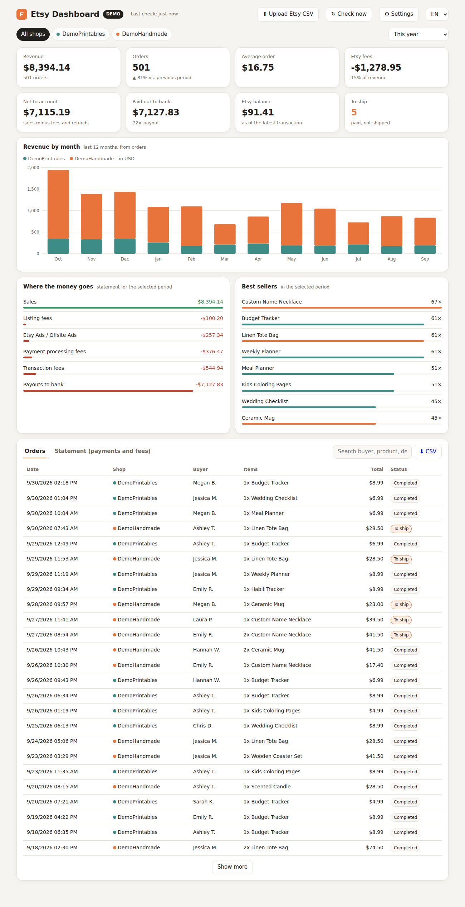

# Etsy Dashboard

A small local dashboard for Etsy sellers: orders, revenue, Etsy fees, payouts and what still needs to ship, for one or more shops in one place. It runs on your own computer and opens in the browser; your data and keys never leave your machine (except for requests to Etsy).



The interface is available in English, Czech and German (switch in the top right corner; it follows your browser language by default). A step-by-step guide in Czech is in [docs/NAVOD.md](docs/NAVOD.md).

## Features

- Revenue, order count, average order, Etsy fees (incl. VAT), net to account, payouts, balance and orders waiting to ship
- Monthly revenue chart (12 months), best sellers, fee breakdown
- Orders and payment-account tables with search and CSV export (Excel-friendly)
- Several shops side by side, filter by shop and period
- Two ways to get data:
  - **CSV import** (works right away): upload the files from *Shop Manager → Settings → Options → Download Data* (Payment Account statements, Orders, Order Items, Payments). Re-uploading the same file never duplicates anything.
  - **Etsy Open API v3** (automatic every 15 minutes) once your Etsy developer app is approved
- New-order notifications in the browser, optionally on your phone via [ntfy](https://ntfy.sh)
- Updates itself from this repository once a day

## Install on macOS

1. Download [Etsy-Dashboard-mac.zip](https://github.com/fanattik/etsy-dashboard/raw/main/dist/Etsy-Dashboard-mac.zip), unzip it and move **Etsy Dashboard** to *Applications*.
2. Open it. The app is not signed with an Apple Developer ID, so macOS blocks the first launch: click *Done*, then go to *System Settings → Privacy & Security* and click *Open Anyway*. This is needed only once.
3. If Python 3 is missing, the app offers to download it from python.org.

The app installs a background service (LaunchAgent) that starts at login, so afterwards the dashboard is always at <http://127.0.0.1:8765>. Uninstall from the dashboard: *Settings → Uninstall*.

## Run anywhere else

Only the Python 3.9+ standard library is needed:

```sh
python3 app/etsy_dashboard.py          # start and open the browser
python3 app/etsy_dashboard.py demo     # demo data, port 8766
python3 app/etsy_dashboard.py jednou   # one API sync without the UI (cron)
```

## Connecting the Etsy API

1. Register an app at <https://www.etsy.com/developers/register>.
2. Add the callback URL `https://localhost:3003/etsy`.
3. After Etsy approves it, paste the *Keystring* and *Shared secret* into *Settings* and sign in each shop. The browser then shows a "can't connect" page; copy the full address from the address bar back into the dashboard.

## Project layout

| Path | What |
| --- | --- |
| `app/etsy_dashboard.py` | local web server, Etsy API sync, CSV import, SQLite storage |
| `app/dashboard.html` | the dashboard UI (no build step, no external libraries) |
| `app/version.json` | version used by the self-updater |
| `mac/launcher.sh`, `mac/build_mac_app.py` | macOS app bundle and its build script (`python3 mac/build_mac_app.py`, needs Pillow for the icon) |
| `dist/Etsy-Dashboard-mac.zip` | built macOS app |

## Releasing an update

Bump `VERSION` in `app/etsy_dashboard.py`, run `python3 mac/build_mac_app.py` (it also rewrites `app/version.json` and the zip) and push to `main`. Installed apps pick it up within a day.

## License

[MIT](LICENSE)
